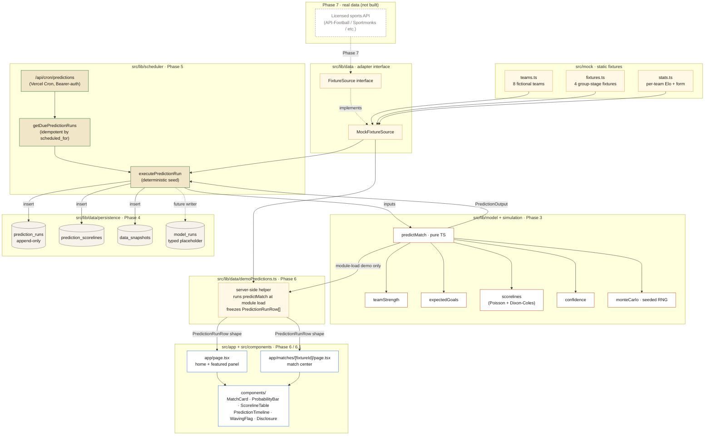
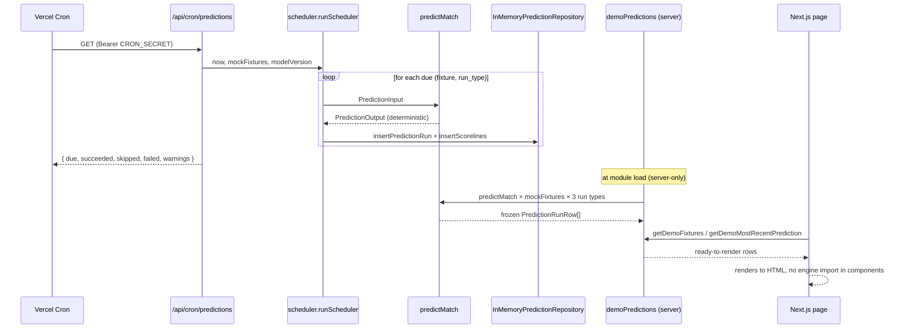
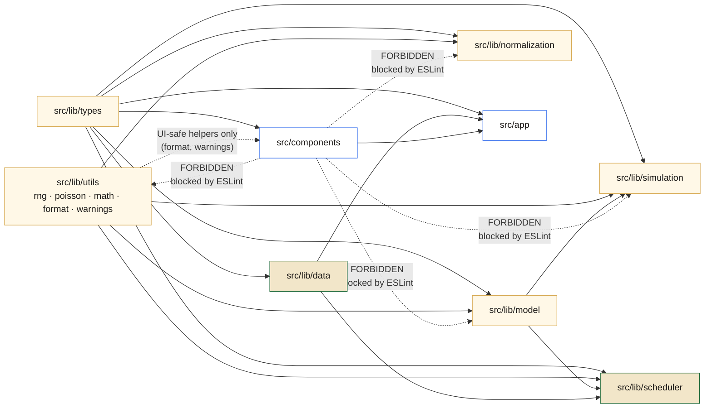

# 12 — Architecture Diagram

A single-page visual reference for the data and dependency flow across the project's six built phases (0 → 6.1). For deeper context on any subsystem, see the cross-references at the end of each section.

---

## 1. End-to-end flow

The diagram colour-codes each subsystem to the warm tournament palette (`docs/07` §2):

- **gold-bordered cards** — mock data and the demo read model
- **red-bordered cards** — the prediction engine
- **green-bordered cards** — the scheduler
- **grey-bordered cards** — persistence
- **blue-bordered cards** — UI
- **dashed grey** — future Phase 7 real data, not built

---

## 2. Where the data goes in production

In the deployed Vercel build today, the cron route fires every 5 minutes and the demo helper runs at module load:

Two important notes about the current state:

1. **The cron route writes to in-memory repositories**, not to Supabase. Phase 5 deliberately stops at the in-memory implementation; the same `PredictionRepository` interface will be satisfied by a Supabase-backed implementation in a follow-up phase without touching scheduler, engine, or UI code.
2. **The demo helper is what the deployed UI reads from.** It runs the real engine, persists into ready-shaped DB rows, freezes them at module load, and exposes typed getters. UI components never see `predictMatch` directly.

---

## 3. Why the UI does not calculate predictions

This is the spine of the architecture. Three independent enforcement layers protect it:

1. **The ESLint UI boundary.** `src/components/**` is forbidden from importing `@/lib/model`, `@/lib/simulation`, `@/lib/normalization`, `@/lib/utils/rng`, or `@/lib/utils/poisson`. Hitting any of those imports fails `pnpm lint` and CI.
2. **The runtime boundary test.** `src/components/__tests__/ui-boundaries.test.ts` reads every `.tsx` file in `src/components/` and asserts no forbidden import pattern is present. Backstop for anything the lint rule misses.
3. **The data shape.** UI components only consume `PredictionRunRow` and `PredictionScorelineRow` — the snake_case DB row shapes from `src/lib/data/persistence/types.ts`. Whether the row was produced by the demo helper or by a future Supabase read, the component contract is identical.

The pay-off is that swapping the data layer (demo → Supabase, mock → live provider) is a one-file change. The UI keeps working unchanged.

---

## 4. Why predictions are append-only

Every prediction run inserts a new row. Updates are forbidden at every layer:

- **DB constraint.** `prediction_runs` carries `UNIQUE (fixture_id, run_type, model_version, scheduled_for)`. Re-running the scheduler at the same lifecycle timestamp collides on this key and is dropped. `UPDATE prediction_runs …` is a code-review reject.
- **TypeScript API.** `PredictionRepository` exposes `insertPredictionRun`, `getPredictionRunById`, `getLatestPredictionForFixture`, `listPredictionHistoryForFixture` — and no `update*` / `patch*` / `delete*` methods. The `InMemoryPredictionRepository` mirrors the same key collision via `DuplicatePredictionRunError`.
- **Scheduler return type.** When the scheduler tries to insert a duplicate, it catches `DuplicatePredictionRunError` and returns `{ status: 'SKIPPED' }`. The earlier row is preserved untouched.

The pay-off is that every match accumulates a complete `T_MINUS_3H → T_MINUS_1H → T_ZERO → HT → FT` history that can be replayed, compared across `model_version` bumps, and evaluated against the actual result via `accuracy_reviews`.

---

## 5. The five-stage prediction lifecycle

```mermaid
gantt
  title  Prediction lifecycle for a single fixture
  dateFormat HH:mm
  axisFormat %H:%M
  section T−3h
    Baseline run :crit, t3, 17:00, 5m
  section T−1h
    Lineup-aware run :crit, t1, 19:00, 5m
  section Kickoff
    T_ZERO snapshot :crit, t0, 20:00, 5m
  section Half-time
    HT recalibration :ht, 20:45, 5m
  section Full-time
    FT accuracy review :ft, 21:50, 5m
```

| Stage         | Trigger                       | What the engine receives                              | What the row carries                               |
|---------------|-------------------------------|-------------------------------------------------------|----------------------------------------------------|
| `T_MINUS_3H`  | kickoff − 3 h                  | ratings, form, context                                | full `PredictionOutput`                            |
| `T_MINUS_1H`  | kickoff − 1 h                  | + lineup if available                                 | full `PredictionOutput` + lineup warning if missing |
| `T_ZERO`      | kickoff                        | best available lineup data                            | final pre-match snapshot                           |
| `HT`          | half-time (gated by status)    | + in-play state                                       | in-play-recalibrated output                        |
| `FT`          | full-time (gated by status)    | observed final score                                  | accuracy-review row                                |

Anchors are deterministic UTC offsets (`scheduler/scheduleWindows.ts`). HT and FT also require `fixture.status === 'HALF_TIME' | 'FULL_TIME'`, so they don't trip on a clock alone.

---

## 6. Module isolation map

The dashed red arrows are import paths the lint rule and the runtime boundary test both block. The only `src/lib/utils` exports a component may consume are the UI-safe helpers in `format.ts` and `warnings.ts` — the math helpers (`rng.ts`, `poisson.ts`) are specifically named in the deny list.

---

## 7. Where to read more

- Engine internals → `docs/03_MODEL_SPEC.md`
- Schema and migrations → `docs/02_TECHNICAL_ARCHITECTURE.md` §6 + `supabase/migrations/0001_init.sql`
- Append-only and idempotency rules → `CLAUDE.md` rule 5 + `docs/06_CLAUDE_CODE_RULES.md` §2
- Engine isolation contract → `docs/06_CLAUDE_CODE_RULES.md` §0/§1
- Design tokens → `docs/07_DESIGN_SYSTEM.md`
- Flag asset registry + wave animation → `docs/08_FLAG_AND_VISUAL_ASSET_POLICY.md`
